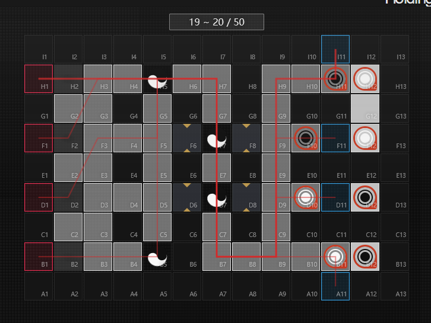
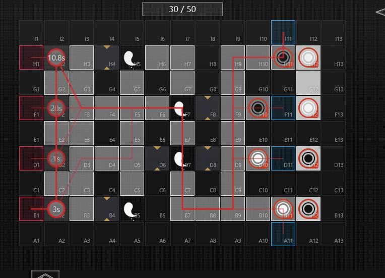
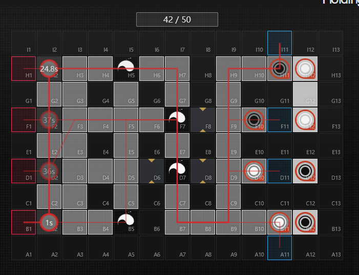
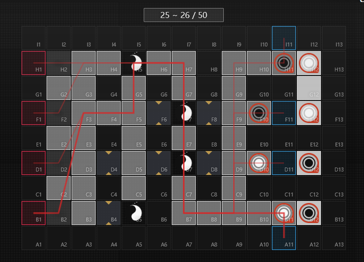
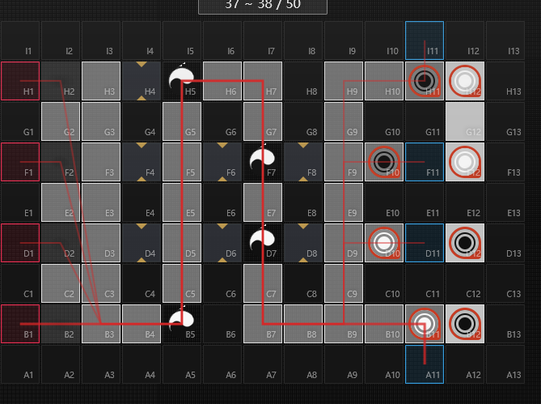
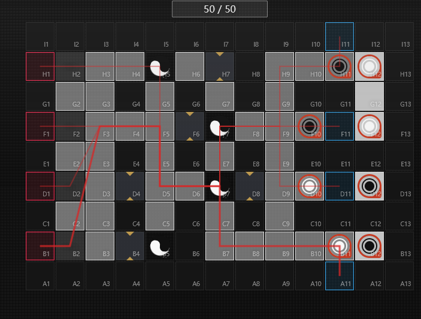

# Description
- One of the mechanics in the **Who is Real** event in Arknights revolves around Hui/Ming (While the text in both CN and EN uses Hui (晦) and Ming (明), the ingame terminology uses Yin and Yang for the values)
- When the damage dealing unit has a different Hui/Ming value as the opposing unit.  The opposing unit takes 40% more damage *(1.4x)*
- When the damage dealing unit has the same Hui/Ming value as the opposing unit.  The opposing unit takes 40% less damage *(0.6x)*
- One of the enemies, known as **Blindey**, and it's red counterpart **Indefatigable Blindey** is only able to be blocked by 
- In WR-EX-6, you are also given Blocks to place, which will influence the path the Blindeys take to their respective exits
## Technical Information
- I will be using Yin/Yang or Light/Dark in my terminology in this section.
- Interestingly, Blindey's can start (spawn in) as either Hui or Ming, this value is determined in the level file in the "yinyang.dynamic" value (most of WR-EX-6, this does not matter, but it did matter for the end)
  - If yinyang.dynamic = 1: Yin (Light)
  - Else if yinyang.dynamic = 0: Yang (Dark)
- It is also important to determine how many switches you want the Blindey to do, in order to match the right side tiles (so your operators can block them)
- Thus in order to optimally place blocks to properly reach the correct yin/yang value, you could use a simulator like [ArkNights WR-EX-6](https://map.ark-nights.com/map/act16d5_ex06) and [ArkNights WR-EX-6 Raid](https://map.ark-nights.com/map/act16d5_ex06#f#) 
  - While noting you are given 3 blocks in Raid version, and cannot retreat them
# Stage Notes
From looking at the simulator, you would notice how many swaps are needed
- 15/50: 
  - 1/1/0/0 (Light, Light, Dark, Dark) -> wants to end up being Dark/Dark/Light/Light
  - As such, you would prefer 3 switches (e.g. slot 1 at row H would want to go Light -> Dark -> Light -> Dark)
  - the 2nd wave within this phase matches the original wave (1/1/0/0)
- 27/50 
  - 1/1/0/0 (Light, Light, Dark, Dark) -> Light, Light, Dark Dark
  - You would need 2 switches
- 39/50 (Reds)
  - 0/0/1/1 (Dark, Dark, Light, Light) -> Light, Dark, Light, Dark
  - This one needs 3 switches, while some needs 2 switches, so your box positioning needs to account for this
  - Specifically 3 switch, 2 switch, 2 switch, 3 switch
## How this looks in practice for Normal version
- 15/50:
  - 
  - add 4 blocks
- 27/50:
  - 
  - remove 1 block, add 2 blocks
- 39/50:
  - 
  - remove 2 blocks

## How this looks in practice for Raid version
- 15/50:
  - 
  - add 3 blocks
- 27/50:
  - 
  - remove 1 block, add 2 blocks
- 39/50:
  - 
  - remove 4 blocks, add 2 blocks
